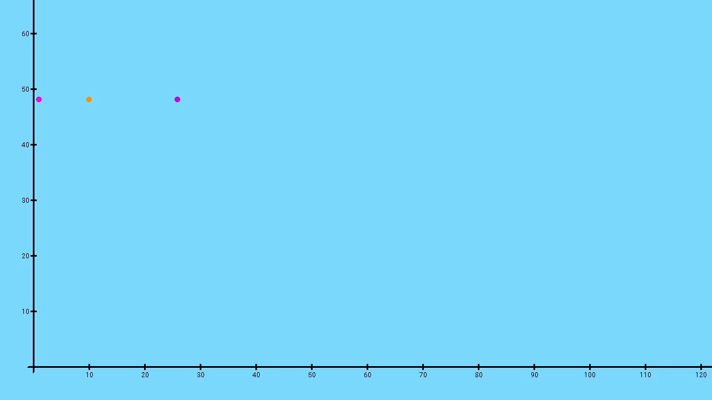

# Tito

This is my old physics engine that I created using SDL2. It allows you to simulate a body in a gravitational field. A body is a sphere that has its own mass and radius. It can have its own speed, acceleration and thrust force. It is influenced by gravity and optionally air resistance.




## Usage
To create a physical object you need to edit function `Engine::AddComponents()` in [Engine.cpp](Tito/src/Core/Engine.cpp)


```cpp
void Engine::AddComponents()
{
	// Adding object example
	GameObjects::GetInstance().Add(
		"sphere1",       /// name
		Color::Pink,	 /// color
		1.0f,            /// mass
		0.1f,            /// radius
		{ 1.0f, 50.0f }, /// position
		{ 0.0f, 0.0f },  /// velocity
		{ 0.0f, 0.0f },  /// acceleration
		{ 0.0f, 0.0f },  /// force
		false	         /// taking air resistance
	);
}
```
- name will be displayed in the logs

- possible colors for the sphere: Blue, Green, Gray, Orange, Pink, Purple, Yellow

- mass, radius, position, velocity, acceleration and force represent the physical properties of a body. They have a value in SI units

- taking air resistance - possible options: true, false

## Default physical values
All values with a unit have a unit consistent with SI

- Gravitational acceleration = {0.0, -9.81}
- Energy remained in the body after the collision = 70%
- Air resistance is expressed by the formula: `0.5 * CrossSectionalArea * AirDensity * DragCoefficient * Velocity * |Velocity|`
  
  	- AirDensity = 1.225
  
  	- DragCoefficient = 0.47
- Only the X axis is considered physical
  
All the above values and many more can be changed in the Engine Properties section in [Engine.cpp](Tito/src/Core/Engine.cpp)
## Controls

- Change display scale - `Scroll wheel`
- Camera movmment - `W` `A` `S` `D`
- Reset camera - `Shift`

## Build

Clone the repository with `git clone https://github.com/wooodiest/Tito`

Project tested in Visual Studio 2022. To generate the project run `GenerateProject.bat`

